# Sovereign AI Workbench

Sovereign AI Workbench is an early-stage project for confidential industrial and enterprise AI work. It aims to provide a self-hosted, model-agnostic environment in which people can use agents, tools, organizational knowledge, and generated artifacts without sending sensitive data to cloud AI services.

## The problem

Many organizations cannot place engineering data, operational records, source code, intellectual property, or regulated information in externally hosted AI systems. They still need a practical way to run capable models, connect approved internal data, automate bounded workflows, and retain control over deployment and security.

This project is intended to make that possible in the `development`, `on-prem`, and `air-gapped` deployment environments.

## Goals

- Run without cloud AI APIs or SDKs at runtime.
- Support local models for reasoning, coding, vision, embeddings, and reranking.
- Keep business logic independent of model families and inference engines.
- Make agents, tools, model providers, knowledge connectors, and artifact generators modular and replaceable.
- Apply deny-by-default controls, explicit tool permissions, and isolated code execution.
- Keep the architecture and dependency footprint small, typed where practical, and testable.
- Treat offline operation as a first-class constraint rather than a fallback.

## Planned architecture

The workbench will be split into a small number of boundaries:

- `apps/web`: the future browser-based user experience.
- `services/api`: the initial application API, model router, and provider boundary.
- `services/model-router`: internal model selection and provider abstraction.
- `packages/contracts`: shared, strongly typed interfaces and schemas.
- `models`: declarative model inventory and deployment-neutral metadata.
- `infrastructure/docker`: future `on-prem` container assets.
- `tests`: cross-component and acceptance tests.
- `synthetic-company`: non-sensitive sample data and evaluation scenarios.

Business code calls capability-oriented internal contracts. Provider adapters are the only layer aware of a particular model server or model family. No real inference runtime is included at this stage.

See [Architecture](docs/architecture.md) for the planned boundaries.

## System architecture

The diagram below shows the current API workflow, model routing path, local provider boundary, agent execution flow, and task persistence layer.

```mermaid
flowchart TD

subgraph group_api["API Workflow"]
  node_api["Sovereign API<br/>[main.py]"]
  node_classifier["Task Classifier"]
  node_planner["Task Planner<br/>[task_planning.py]"]
end

subgraph group_routing["Model Routing"]
  node_registry_loader["Registry Loader<br/>[loader.py]"]
  node_registry["Model Registry<br/>[registry.yaml]"]
  node_router["Model Router<br/>[router.py]"]
  node_eligibility["Eligibility Filter<br/>[eligibility.py]"]
  node_optimizer["Model Optimizer<br/>[optimizer.py]"]
end

subgraph group_providers["Local Providers"]
  node_adapters["Provider Adapters"]
  node_transport["Compatible Transport"]
end

subgraph group_agents["Agent Execution"]
  node_orchestrator["Task Orchestrator<br/>[orchestration.py]"]
  node_stage_coordinator["Stage Coordinator"]
  node_tool_executor["Tool Executor<br/>[tool_execution.py]"]
  node_tool_policy["Tool Policy<br/>[tool_policy.py]"]
  node_workspace["Workspace Artifacts"]
end

subgraph group_persistence["Task Persistence"]
  node_output_store[("Stage Output Store")]
  node_task_repository[("Task State Repository")]
end

node_user(("User"))
node_local_server["Local Model Server"]

node_user -->|"submits request"| node_api
node_api -->|"classifies task"| node_classifier
node_api -->|"plans requirements"| node_planner
node_api -->|"routes request"| node_router
node_api -->|"invokes provider"| node_adapters
node_api -->|"loads registry"| node_registry_loader
node_registry_loader -->|"reads models"| node_registry
node_router -->|"filters models"| node_eligibility
node_router -->|"ranks candidates"| node_optimizer
node_adapters -->|"delegates completion"| node_transport
node_transport -->|"posts prompt"| node_local_server
node_orchestrator -->|"executes stages"| node_stage_coordinator
node_stage_coordinator -->|"routes model stage"| node_router
node_stage_coordinator -->|"runs tool stage"| node_tool_executor
node_tool_executor -->|"checks permissions"| node_tool_policy
node_stage_coordinator -->|"writes outputs"| node_output_store
node_stage_coordinator -->|"reads prior output"| node_output_store
node_stage_coordinator -->|"advances state"| node_task_repository
node_tool_executor -.->|"writes artifacts"| node_workspace

click node_api "https://github.com/rugved28116/sovereign-ai-workbench/blob/master/services/api/src/sovereign_api/main.py"
click node_classifier "https://github.com/rugved28116/sovereign-ai-workbench/blob/master/services/api/src/sovereign_api/task_classification.py"
click node_planner "https://github.com/rugved28116/sovereign-ai-workbench/blob/master/services/api/src/sovereign_api/task_planning.py"
click node_registry_loader "https://github.com/rugved28116/sovereign-ai-workbench/blob/master/services/api/src/sovereign_api/registry/loader.py"
click node_registry "https://github.com/rugved28116/sovereign-ai-workbench/blob/master/models/registry.yaml"
click node_router "https://github.com/rugved28116/sovereign-ai-workbench/blob/master/services/api/src/sovereign_api/routing/router.py"
click node_eligibility "https://github.com/rugved28116/sovereign-ai-workbench/blob/master/services/api/src/sovereign_api/routing/eligibility.py"
click node_optimizer "https://github.com/rugved28116/sovereign-ai-workbench/blob/master/services/api/src/sovereign_api/routing/optimizer.py"
click node_adapters "https://github.com/rugved28116/sovereign-ai-workbench/tree/master/services/api/src/sovereign_api/providers"
click node_transport "https://github.com/rugved28116/sovereign-ai-workbench/blob/master/services/api/src/sovereign_api/providers/_openai_compatible.py"
click node_orchestrator "https://github.com/rugved28116/sovereign-ai-workbench/blob/master/services/api/src/sovereign_api/orchestration.py"
click node_stage_coordinator "https://github.com/rugved28116/sovereign-ai-workbench/blob/master/services/api/src/sovereign_api/agent_stage_execution.py"
click node_tool_executor "https://github.com/rugved28116/sovereign-ai-workbench/blob/master/services/api/src/sovereign_api/tool_execution.py"
click node_tool_policy "https://github.com/rugved28116/sovereign-ai-workbench/blob/master/services/api/src/sovereign_api/tool_policy.py"
click node_output_store "https://github.com/rugved28116/sovereign-ai-workbench/blob/master/services/api/src/sovereign_api/stage_output_store.py"
click node_task_repository "https://github.com/rugved28116/sovereign-ai-workbench/blob/master/services/api/src/sovereign_api/task_state_repository.py"
click node_workspace "https://github.com/rugved28116/sovereign-ai-workbench/blob/master/services/api/src/sovereign_api/workspace_write_artifact.py"

classDef toneNeutral fill:#f8fafc,stroke:#334155,stroke-width:1.5px,color:#0f172a
classDef toneBlue fill:#dbeafe,stroke:#2563eb,stroke-width:1.5px,color:#172554
classDef toneAmber fill:#fef3c7,stroke:#d97706,stroke-width:1.5px,color:#78350f
classDef toneMint fill:#dcfce7,stroke:#16a34a,stroke-width:1.5px,color:#14532d
classDef toneRose fill:#ffe4e6,stroke:#e11d48,stroke-width:1.5px,color:#881337
classDef toneIndigo fill:#e0e7ff,stroke:#4f46e5,stroke-width:1.5px,color:#312e81
classDef toneTeal fill:#ccfbf1,stroke:#0f766e,stroke-width:1.5px,color:#134e4a
class node_api,node_classifier,node_planner,node_user toneBlue
class node_registry_loader,node_registry,node_router,node_eligibility,node_optimizer toneAmber
class node_adapters,node_transport,node_local_server toneMint
class node_orchestrator,node_stage_coordinator,node_tool_executor,node_tool_policy,node_workspace toneRose
class node_output_store,node_task_repository toneIndigo
```

## Privacy philosophy

Data sovereignty is the default. The system must not assume internet access, transmit information externally, or silently broaden a user's permissions. Secrets belong outside version control. Security-sensitive operations should fail closed, tool access should be explicit and auditable, and generated code should eventually execute only inside constrained sandboxes.

## Project status

This repository now contains the first backend slice: a FastAPI health and generation API, registry validation, sovereign eligibility filtering, deterministic routing, and development-only mock inference. It does **not** contain a frontend, real model inference, containers, databases, or production deployment assets.

## High-level roadmap

1. Define typed contracts and threat models.
2. Build a minimal API, web shell, and mock provider path.
3. Add local provider adapters and capability-based routing.
4. Introduce permissioned tools, isolated execution, and approved knowledge connectors.
5. Harden, test, package, and document `on-prem` and `air-gapped` operations.

The detailed sequence and exit criteria are in the [development roadmap](docs/development-roadmap.md).

## Repository policy

Architecture changes must be documented. Every implemented component should have proportionate automated tests. New dependencies require a clear need and must remain compatible with offline deployment. See [AGENTS.md](AGENTS.md) for contribution rules used by coding agents.

## License

Licensed under the Apache License 2.0. See [LICENSE](LICENSE).
